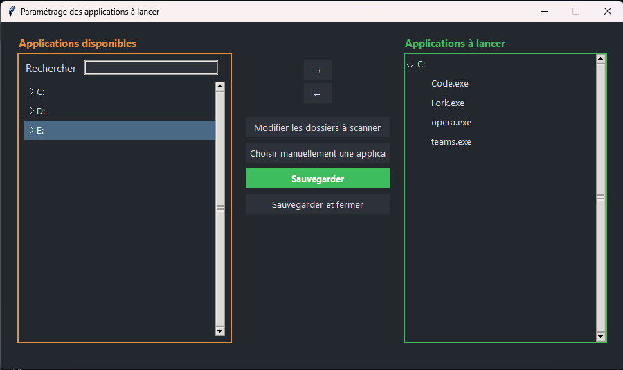

# GetReadyToWork

GetReadyToWork is originally a python script created to free its user from the repetitive daily task of launching every app he needs on its machine before being able to work.
For exemple, a programmer would tipically start the day by launching his mailing app, his favorite browser, an IDE, a git GUI or whatever, before being able or willing to work.
----> What about doing it all with one click and go fetch some coffee instead ?

GetReadyToWork lets you launch your favorite applications in one click, with a multi-language cross-platform interface (Windows, macOS, Linux).

<code style="color : name_color">End users do NOT need to install Python or any dependencies. Just use the provided executable for your OS</code>

## Main Features
- **Graphical selection of applications to launch** (search, disk grouping)
- **Configurable scan folders** for automatic detection
- **Manual selection from all installed applications** (independent from scan folders, works on every OS)
- **Multi-language** (French/English, auto-detection)
- **Modern and responsive UI** (loader during scans, robust error handling, etc.)
- **Robust configuration** (auto-save, per-OS scan paths)

## Quick Start

### Requirements
- Python 3.10+
- (Windows only) `pip install winapps` for full app detection

### Local Launch (Development)
1. Clone this repository
2. Install dependencies:
   - Windows: `pip install -r installers/requirements-windows.txt`
   - Linux/Mac: `pip install -r installers/requirements-linux.txt`
   - On Windows, also run: `pip install winapps`
3. Launch the apps:
   - **Launcher:**
     - `python -m src.app_launcher.GetReadyToWork`
   - **Configuration GUI:**
     - `python -m src.app_configurator.ParametrageGetReadyToWork`

### Usage
- Use the configuration GUI to select and organize the applications you want to launch.
- The launcher will start all selected apps in one click.
- All configuration is saved in the `runtime/` folder.

## Project Structure
- `src/app_launcher/` : Main launcher (`GetReadyToWork.py`)
- `src/app_configurator/` : Configuration GUI (`ParametrageGetReadyToWork.py`, `GUI.py`)
- `src/common/` : Shared utilities
- `src/config/` : i18n and scan path resources
- `src/runtime/` : User config and runtime files

## Packaging (for maintainers)
- Use the provided build scripts (`tools/build-windows.bat`, `tools/build-linux.sh`, `tools/build-mac.sh`) to create standalone executables with PyInstaller.
- Release folders (`release-windows/`, `release-linux/`, `release-mac/`) are generated automatically and should not be committed.

---

For questions or contributions, open an issue or pull request on GitHub.

---
Authored by Samuel VANNIER

